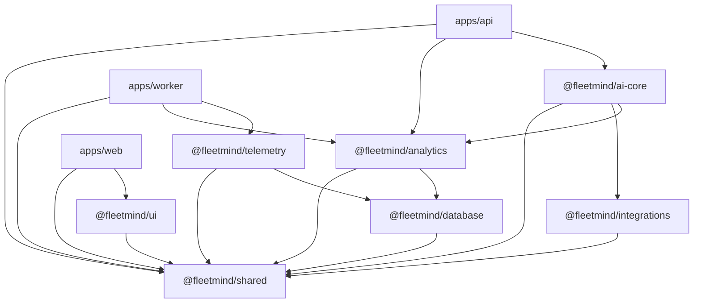

# Fleet Mind AI Architecture Blueprint

## Target Structure

```text
fleet-intelligence-ai/
  apps/
    web/
    api/
    worker/
  packages/
    shared/
    database/
    telemetry/
    analytics/
    ai-core/
    integrations/
    ui/
  docs/
```

## Core System Flow

1. User asks a question in `apps/web`.
2. `apps/api` validates request and forwards to `@fleetmind/ai-core`.
3. `@fleetmind/ai-core` orchestrator selects deterministic tools from `ToolRegistry`.
4. Tools call `@fleetmind/analytics`, `@fleetmind/telemetry`, and `@fleetmind/integrations`.
5. Domain packages read/write through `@fleetmind/database`.
6. AI core composes a grounded prompt containing only returned facts/citations.
7. LLM explains results and recommendations without generating raw business metrics.

## Non-Negotiable AI Rules

- LLM is a reasoner and narrator, not a calculator.
- All business KPIs come from deterministic backend functions.
- Every numeric claim in AI output must map to `ToolResult.citations`.
- Tool execution must be auditable with `requestId` and `tenantId`.
- Missing data should produce explicit uncertainty text, never fabricated values.

## Package Responsibilities

- `@fleetmind/shared`
  - Cross-package contracts, enums, Zod DTO shapes, and utility types.
  - No runtime infra dependencies.
- `@fleetmind/database`
  - Prisma schema, migrations, tenant-scoped repositories, transaction helpers.
  - No imports from analytics/ai/web.
- `@fleetmind/telemetry`
  - Ingestion validators, dedupe, timeline storage, trip construction.
  - Can depend on shared + database only.
- `@fleetmind/analytics`
  - KPI formulas, profitability and efficiency engines, forecast routines.
  - Can depend on shared + database only.
- `@fleetmind/integrations`
  - Third-party provider adapters (GPS/fuel/accounting/maintenance).
  - Returns normalized records to shared contracts.
- `@fleetmind/ai-core`
  - Tool registry, orchestration, grounding policies, conversation memory abstractions.
  - Depends on analytics + integrations + shared.
- `@fleetmind/ui`
  - Shared React components/charts.
  - No backend package imports.
- `apps/api`
  - API endpoints, auth middleware, validation, orchestration entrypoint.
- `apps/worker`
  - BullMQ processors for ingestion, batch analytics, backfills, forecasts.
- `apps/web`
  - React chat UX, dashboards, and insights presentation.

## Dependency Rules

- Allowed direction: `apps/* -> packages/*`, never reverse.
- `@fleetmind/shared` is leaf/base and can be imported by any package.
- `@fleetmind/database` cannot import any domain/AI/UI app package.
- `@fleetmind/ai-core` cannot import `@fleetmind/database` directly.
- `@fleetmind/ui` must remain presentation-only.
- Cross-package communication should use interfaces/contracts from `@fleetmind/shared`.

## Shared Contract Coverage

Defined in `packages/shared/src/contracts`:

- domain entities: `Vehicle`, `TelemetryPoint`, `Trip`, `FuelReading`, `MaintenanceRecord`, `Insight`, `MetricValue`
- AI contracts: `ToolRequest`, `ToolResult`, `CopilotGroundingPayload`, `CopilotResponse`
- analytics outputs: `AnalyticsOutput`, `ProfitabilitySummaryOutput`, `ForecastOutput`

This design allows each package to implement independently against a stable shared API.

## AI Tool Architecture

### Tool Interface

```ts
export interface ToolDefinition<TInput, TOutput> {
  name: ToolName;
  description: string;
  inputSchema: ZodSchema<TInput>;
  execute(input: TInput, context: ToolContext): Promise<ToolResult<TOutput>>;
}
```

### ToolRegistry

- Registry is initialized at API startup.
- Each tool registers once with unique `ToolName`.
- Registry validates input using the tool `inputSchema`.
- Registry returns structured `ToolResult` with citations.

### Agent Orchestrator

- Parse user intent and map to required tool chain.
- Execute tools sequentially or in bounded parallel based on dependency.
- Aggregate deterministic outputs into `CopilotGroundingPayload`.
- Call LLM with strict response contract and citation requirements.
- Post-validate response: reject if numeric claims lack supporting citations.

### Conversation Memory Strategy

- Store conversation turns by `tenantId`, `userId`, and `sessionId`.
- Persist only:
  - user question
  - selected tools
  - structured tool outputs
  - final grounded response
- Do not persist hidden chain-of-thought.
- Memory supports follow-up prompts and context pruning.

### Grounding Strategy

- Prompt template includes:
  - known facts from tools
  - unknowns/gaps
  - recommendation style constraints
  - numeric citation enforcement
- If facts unavailable, assistant responds with data request or fallback action.

### MCP Future-Compatibility (Design-Only)

- Keep `ToolDefinition` transport-agnostic.
- Support adapters: local function tools now, MCP-backed tools later.
- Add capability metadata (`latencyClass`, `costClass`, `requiresScopes`) on tool definitions.

## Multi-Tenant and Streaming Readiness

- Every domain record includes `tenantId`.
- Repository APIs require tenant context argument.
- Queue jobs include tenant-aware payload envelope.
- Telemetry ingestion contract supports append-only events and out-of-order correction.
- Reserve message bus abstraction for future real-time streams (Kafka/NATS optional later).

## Monorepo Foundation Standards

- Package manager: pnpm workspaces.
- TypeScript: strict base config shared by all packages/apps.
- Linting: ESLint with TypeScript rules.
- Formatting: Prettier + EditorConfig.
- Validation: Zod for external inputs and API boundaries.
- Runtime infra: Docker Compose with PostgreSQL + Redis.
- Testing baseline:
  - packages: Vitest or Jest by package choice.
  - API integration and worker flows: Jest recommended.

## Recommended Implementation Order

1. `@fleetmind/shared` contracts hardened with Zod schemas and fixtures.
2. `@fleetmind/database` Prisma schema and repository interfaces.
3. `@fleetmind/telemetry` ingestion + trip builder.
4. `@fleetmind/analytics` KPI engine and deterministic forecasts.
5. `@fleetmind/integrations` provider adapters.
6. `@fleetmind/ai-core` tool registry + orchestrator + grounding.
7. `apps/api` HTTP endpoints and auth.
8. `apps/worker` queues and scheduled jobs.
9. `packages/ui` and `apps/web` chat/dashboard UX.
10. full test and QA hardening.

## Package Dependency Graph


